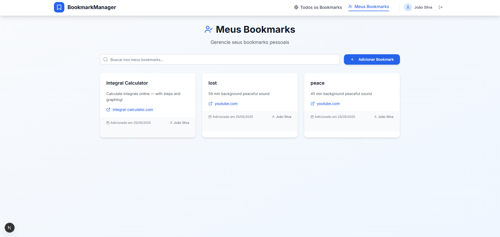

# Projeto: Aplicação web com persistência de dados do lado do servidor

> 1. Baixe este arquivo e edite o texto em formato Markdown conforme as instruções a seguir.
> 2. Substitua todos os trechos de texto iniciados com "Substitua" por informações do seu projeto, conforme solicitado em cada trecho.
> 3. Substitua a imagem por um screenshot do projeto (arquivo pode ser armazenado no repositório ou em URL externa). GIFs animados também são permitidos!
> 4. Remova todas as instruções de entrega.
> 5. Double-check: Certifique-se de que seu README.md não contenha instruções de entrega!
> 6. Entregue este README.md dentro da pasta raiz do repositório de entrega.
> Opcional: é permitido alterar a formatação do README, desde que sejam mantidas todas as informações solicitadas (tudo bem adicionar mais informações)

Acesso: Substitua este texto pela URL de deploy do projeto

### Desenvolvedores
Thales Stamm - Sistemas de Informação

### Nosso produto

O produto desenvolvido é uma aplicação web para compartilhamento de links e bookmarks, que permite aos usuários armazenar, organizar e gerenciar seus links de forma simples e eficiente. Entre as principais funcionalidades estão:

Cadastro de links: Adicione links com informações básicas como título e descrição.

Listagem de bookmarks: Visualize seus links ou outros compartilhados em uma lista com os detalhes cadastrados, podendo buscar e filtrar por título, descrição ou autor.

CRUD completo: Os usuários podem criar, editar, visualizar e excluir links conforme necessário.

Persistência de dados: Todos os links são salvos em um banco de dados PostgreSQL.

Interface intuitiva: Um frontend simples e funcional que facilita a navegação e uso por qualquer pessoa.

### Desenvolvimento

Etapas do trabalho:

Planejamento inicial: Decidi usar uma stack moderna e eficiente para desenvolvimento full-stack, com foco em Next.js para o frontend e API, Prisma para ORM, e PostgreSQL como banco de dados.

Estruturação do banco de dados: Criação de um schema no Prisma para organizar as entidades necessárias, pensando no que seria necessário guardar em um bookmark.

Implementação do backend: Configuração de rotas de API usando Next.js API Routes, com suporte a operações de CRUD.

Desenvolvimento do frontend: Construção de componentes com React e estilização básica para exibição de bookmarks e interação/busca do usuário.

Teste e integração: Validação das funcionalidades e correção de bugs detectados durante o processo.

Preparação para deploy: Configuração do ambiente de produção para hospedar o sistema.

Decisões importantes:

Priorização de funcionalidades essenciais para garantir o preenchimento dos requisitos dentro do prazo.

#### Tecnologias

## Frontend:

HTML5

CSS3

React (via Next.js)

TailwindCSS

## Backend:

Next.js API Routes

Prisma (ORM)

PostgreSQL (banco de dados)

## Outras bibliotecas e ferramentas:

bcryptjs (para hash de senhas)

jsonwebtoken (autenticação)

tsx (para execução de scripts em TypeScript)

shadcn (componentes estilizados)

#### Ambiente de desenvolvimento

IDE: Visual Studio Code
banco de dados: PostgreSQL

#### Referências e créditos

Next.js - https://nextjs.org/docs

Prisma - https://www.prisma.io/docs

TailwindCSS - https://tailwindcss.com/docs/installation/using-vite

HeroIcons - https://heroicons.com/

ChatGPT, Gemini - correção de bugs, revisão de código, auxílio na criação de usuários e sistema de login, auxílio no design.

---
Projeto entregue para a disciplina de [Desenvolvimento de Software para a Web](http://github.com/andreainfufsm/elc1090-2025a) em 2025a
